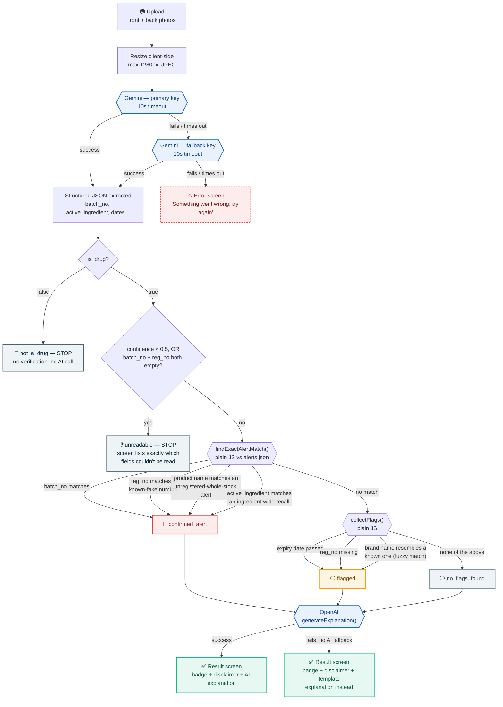

# How a photo becomes a verdict

Every box below is a real step in the code. Every JSON snippet is real output from an actual test run — nothing here is invented. Follow the Retrax example if you want to see the "unique" active-ingredient match end to end.

Vision extraction (Gemini) → deterministic verification (plain JS, no AI) → explanation (OpenAI) → result screen.

## The full flow



**Legend**: 🔴 confirmed alert · 🟡 flagged · ⚪/🚫/❓ no flags or early stop · 🔷 an AI call · 🟢 final result screen.

> If your Markdown viewer doesn't render Mermaid (GitHub, VS Code with the Mermaid extension, and most modern renderers do), the same diagram is published as an interactive artifact: https://claude.ai/artifact/KFPie9s5YfFNK65hWLn7yv

## Worked examples

Real extraction → real verification → real AI explanation, from actual test runs.

### Retrax Worm Syrup — the unique one

**Status: `confirmed_alert`** — matched by **active ingredient**, not batch number or brand name. The only alert in the dataset that works this way.

**1. Gemini extracts this from the photo:**

```json
{
  "is_drug": true,
  "confidence": 0.95,
  "product_name": "RETRAX Worm Syrup",
  "manufacturer": "REALS",
  "active_ingredient": "Levamisole 40mg/5ml",
  "batch_no": "RN 262",
  "nafdac_reg_no": "04-3940",
  "mfg_date": "2025-11",
  "expiry_date": "2028-10",
  "visible_issues": null
}
```

↓ plain JS checks this against `alerts.json` — no AI involved

**2. `verifyMedicine()` finds this alert entry:**

```json
{
  "alert_id": "030/2026",
  "type": "foreign_recall_neurological_risk",
  "product": "Levamisole-containing medicines",
  "active_ingredient": "Levamisole",
  "issue": "Withdrawal from the EU market endorsed by Italy's AIFA after an EU-wide review found the benefits no longer outweigh the risk of leukoencephalopathy…"
}
```

> **Why it matched:** `"levamisole 40mg/5ml".includes("levamisole")` → `true`. That's the entire check — a lowercase, trimmed substring comparison. `batch_no: "RN 262"` and `nafdac_reg_no: "04-3940"` match nothing in the dataset; they're irrelevant to this decision.

↓ result object passed to OpenAI — only this JSON, never the photo

**3. OpenAI writes the explanation:**

> "This result was reached because the active ingredient in Retrax Worm Syrup, Levamisole, matches the active ingredient specified in a recall alert. The alert involves levamisole-containing medicines that have been withdrawn from the EU market after a review found that the potential risk of developing a severe neurological condition called leukoencephalopathy outweighs the benefits."
>
> Source: nafdac.gov.ng, Public Alert 030/2026

---

### Augmentin, batch AC3N

**Status: `confirmed_alert`** — matched the ordinary way: exact batch number match.

**1. Extraction:**

```json
{ "batch_no": "AC3N", "nafdac_reg_no": "04-1234", "product_name": "Augmentin 625mg" }
```

↓ `normalize(batch_no) === normalize(alert.batch_no)` → match on alert `024/2026`

**2. Explanation:**

> "…the batch number 'AC3N' matches a real NAFDAC alert regarding counterfeit issues with this product… the batch number is genuine but has incorrect date labels, suggesting the product may be counterfeit."
>
> Source: nafdac.gov.ng, Public Alert 024/2026

---

### Augmentin, no alert match

**Status: `flagged`** — no exact match found, falls through to deterministic rule checks.

**1. Extraction:**

```json
{ "batch_no": "786627", "nafdac_reg_no": null, "expiry_date": "2019-08" }
```

↓ `collectFlags()`: expiry < today? yes. reg_no empty? yes.

**2. Flags produced (plain JS, no AI):**

```json
[
  { "type": "expired", "message": "…expiry date (2019-08) has already passed." },
  { "type": "missing_reg_no", "message": "No NAFDAC registration number is visible…" }
]
```

**3. Explanation:**

> "…flagged because the expiration date shown on the package has already passed, having expired in August 2019. Additionally, there is no visible NAFDAC registration number on the pack…"

---

### Non-drug photo & blurry photo

**Status: `not_a_drug` / `unreadable`** — both stop *before* verification and *before* any explanation call. No wasted API cost, no guessing.

```json
{ "is_drug": false, "confidence": 0, "product_name": null }
```
↓ `is_drug` is false → STOP, screen says "doesn't look like a medicine"

```json
{ "is_drug": true, "confidence": 0.3, "batch_no": null, "nafdac_reg_no": null, "visible_issues": "Blurry print" }
```
↓ confidence < 0.5 AND both key fields empty → STOP, screen lists: *Product name, Batch number, NAFDAC registration number, Expiry date*

---

Every value above came from real API calls against real (or realistic synthetic) test images in `test-images/`. Matching logic lives entirely in `src/logic/verifyMedicine.js` — no AI runs during that step.
